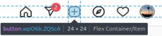
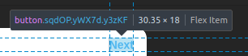
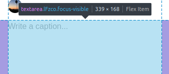

# Run it!
## First time
1. `conda env create environment.yml`
2. `sudo apt install firefox`
3. `chmod +x instabot.sh`
### Initialize your environment
1. Replace `username` and `password` in your config with your username and password. Remember **never** to commit & push your config!
2. Determine the classNames associated with a few different components on your Instagram web page. This is a little bit cumbersome, and I'll try to find a way around it, but for now this is the process 😞

| Field | Screenshot |
|-|-|
| Replace `new-post-selector` with the className for the New Post button. |  |
| Replace `button-selector` with the className for the Next button. This should cover all of our major buttons. |  |
| Replace `caption-selector` with the className for the Textarea in the captioning flow.| |

## Each time
1. `bash -i instabot.sh`
    - Replace `sample_config.yml` with your config file.
    - The `sample_config.yml` file is preloaded with reference to a couple of test images you can use to try the tool out.

# Built with
- [Github Copilot](https://copilot.github.com/)
- [Selenium](https://www.selenium.dev/documentation/webdriver/browser/)
